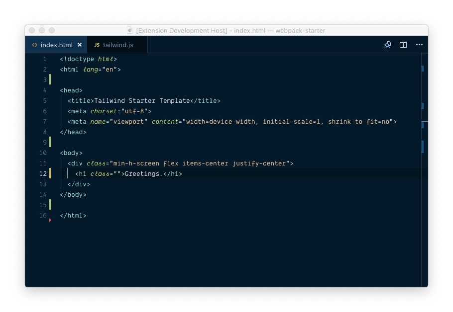

# Tailwind CSS Autocomplete for Visual Studio Code

Currently supports [Tailwind CSS](https://github.com/tailwindcss/tailwindcss) v0.6.5

## Features

- Supports **autocomplete** for _all_ Tailwind classes
- Reads your project's `tailwind.js` config and **reacts to changes in realtime**
  - Example: Add a new color called lilac to config for text colors and `text-lilac` will appear in autocomplete **instantly**
- Works with several languages modes including HTML, JavaScript, JavaScript React, TypeScript React, PHP and Vue
- Supports @apply in CSS and SCSS files
- Supports Emmet shortcuts
- No need for generated CSS on disk for autocomplete to work (Works with **webpack dev server** too)

## Installation

Install this extension from the VS Code extensions marketplace. Search for `Tailwind CSS Autocomplete` or go [here](https://marketplace.visualstudio.com/items?itemName=sidharthachatterjee.vscode-tailwindcss)

You can also install this via Quick Open (⌘P)

`ext install sidharthachatterjee.vscode-tailwindcss`

## Configuration

There is none! 🎉

This extension reads config from the currently open project's `tailwind.js` file and that's about it

## Known Limitations

- Currently doesn't generate suggestions for Tailwind prefixes including hover, media query sizes etc
- Doesn't use the project's version of Tailwind to generate classes so if you're using an older version of Tailwind, you might see mismatched suggestions 😞

## Thanks

- Special thanks to [Adam Wathan](https://github.com/adamwathan) for Tailwind CSS ❤️
- Thanks to [zignd](https://github.com/zignd) for [HTML-CSS-Class-Completion](https://github.com/zignd/HTML-CSS-Class-Completion). Regexes and some logic was borrowed from there

## Contributions

Feel free to open an issue or submit a pull request for anything you think is missing
